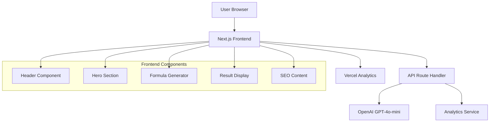

# Design Document: Excel AI Formula Generator

## Overview

The Excel AI Formula Generator is a high-performance, single-page Next.js application that converts natural language descriptions into Excel and Google Sheets formulas. The system is architected for maximum speed, SEO optimization, and user experience while maintaining zero barriers to entry (no login, no payment).

The application follows a simple request-response pattern: users input natural language descriptions, the system processes them through OpenAI's GPT-4o-mini, and returns formatted formulas with explanations. The entire interface is contained within a single scrollable page optimized for organic search traffic capture.

## Architecture

### High-Level Architecture



### System Architecture Principles

1. **Single Page Application**: All functionality contained within one scrollable page
2. **Server-Side Rendering**: Next.js App Router for optimal SEO and performance
3. **API-First Design**: Clean separation between frontend and AI processing
4. **Progressive Enhancement**: Core functionality works without JavaScript
5. **Mobile-First Responsive**: Optimized for all device sizes

## Components and Interfaces

### Frontend Components

#### Header Component
- **Purpose**: Brand identity and trust building
- **Elements**: Logo, minimal navigation, trust badge
- **Props**: None (static content)
- **Styling**: Clean, professional SaaS aesthetic

#### Hero Section Component
- **Purpose**: SEO optimization and user engagement
- **Elements**: H1 headline, sub-headline, value proposition
- **Props**: None (static SEO-optimized content)
- **SEO Requirements**: H1 must match target keyword exactly

#### Formula Generator Component
- **Purpose**: Core functionality for formula generation
- **Props**:
  - `platform: 'excel' | 'google-sheets'`
  - `onGenerate: (input: string, platform: string) => void`
  - `isLoading: boolean`
- **State Management**: 
  - Input text
  - Selected platform
  - Loading state
- **Child Components**: Platform tabs, input area, quick tags, generate button

#### Result Display Component
- **Purpose**: Show generated formulas with copy functionality
- **Props**:
  - `formula: string | null`
  - `explanation: string | null`
  - `isVisible: boolean`
- **Features**: Code block display, copy button, explanation text, feedback buttons

#### SEO Content Component
- **Purpose**: Long-tail keyword capture and user education
- **Elements**: Feature grid, FAQ accordion
- **Props**: None (static content optimized for search)

### API Interfaces

#### Formula Generation Endpoint
```typescript
// POST /api/generate-formula
interface GenerateFormulaRequest {
  input: string;
  platform: 'excel' | 'google-sheets';
}

interface GenerateFormulaResponse {
  success: boolean;
  data?: {
    formula: string;
    explanation: string;
  };
  error?: string;
}
```

#### Analytics Event Interface
```typescript
interface AnalyticsEvent {
  event: 'formula_generated' | 'copy_formula' | 'platform_toggle';
  properties: {
    platform?: string;
    input_length?: number;
    success?: boolean;
  };
}
```

### OpenAI Integration Interface

#### System Prompt Structure
```typescript
interface AIPrompt {
  role: 'system' | 'user';
  content: string;
}

interface AIResponse {
  formula: string;
  explanation: string;
}
```

## Data Models

### Formula Request Model
```typescript
interface FormulaRequest {
  id: string;
  input: string;
  platform: 'excel' | 'google-sheets';
  timestamp: Date;
  userAgent?: string;
}
```

### Formula Response Model
```typescript
interface FormulaResponse {
  id: string;
  requestId: string;
  formula: string;
  explanation: string;
  success: boolean;
  processingTime: number;
  timestamp: Date;
}
```

### Analytics Event Model
```typescript
interface AnalyticsEvent {
  id: string;
  event: string;
  properties: Record<string, any>;
  timestamp: Date;
  sessionId?: string;
}
```

### UI State Model
```typescript
interface AppState {
  selectedPlatform: 'excel' | 'google-sheets';
  inputText: string;
  isLoading: boolean;
  currentResult: {
    formula: string;
    explanation: string;
  } | null;
  error: string | null;
}
```

## Correctness Properties

*A property is a characteristic or behavior that should hold true across all valid executions of a system—essentially, a formal statement about what the system should do. Properties serve as the bridge between human-readable specifications and machine-verifiable correctness guarantees.*

### Property Reflection

After analyzing the acceptance criteria, I identified several properties that can be consolidated:
- Properties 1.3 and 1.4 (platform-specific formula generation) can be combined into a single platform-specific generation property
- Properties 2.3, 2.4, and 2.5 (result display functionality) can be combined into a comprehensive result display property
- Properties 6.1, 6.2, and 6.3 (analytics tracking) can be combined into a single analytics tracking property
- Properties 7.4 and 7.5 (error handling stability) can be combined into a single error resilience property

### Core Properties

**Property 1: Natural Language to Formula Conversion**
*For any* valid natural language description of a spreadsheet operation, the Formula_Generator should produce a syntactically valid formula string and a non-empty explanation
**Validates: Requirements 1.1, 1.2**

**Property 2: Platform-Specific Formula Generation**
*For any* natural language input and selected platform (Excel or Google Sheets), the generated formula should use syntax appropriate to that platform
**Validates: Requirements 1.3, 1.4**

**Property 3: Platform Selection State Management**
*For any* platform switch operation, the interface should update to reflect the selected platform and maintain that selection until changed
**Validates: Requirements 2.2**

**Property 4: Result Display Completeness**
*For any* successfully generated formula, the Result_Display should show the formula in a code block, provide a copy button, and execute clipboard copy with confirmation when clicked
**Validates: Requirements 2.3, 2.4, 2.5**

**Property 5: Quick-Fill Tag Functionality**
*For any* quick-fill tag click, the input field should be populated with the corresponding example text
**Validates: Requirements 3.4**

**Property 6: Loading State Management**
*For any* formula generation request, the UI should show a loading state during processing and clear it when complete
**Validates: Requirements 3.5**

**Property 7: Analytics Event Tracking**
*For any* user interaction (formula generation, copy action, platform switch), the Analytics_Tracker should record the appropriate event with correct properties
**Validates: Requirements 6.1, 6.2, 6.3**

**Property 8: Error Resilience**
*For any* API failure or error condition, the application should remain stable, maintain current state, and provide appropriate user feedback
**Validates: Requirements 7.4, 7.5**

**Property 9: AI Response Structure**
*For any* successful AI integration response, the output should be valid JSON containing both formula and explanation fields
**Validates: Requirements 8.2, 8.3**

**Property 10: AI Response Validation**
*For any* AI response received, the system should validate the response format before displaying results to users
**Validates: Requirements 8.5**

**Property 11: Platform-Aware AI Processing**
*For any* formula generation request, the AI integration should handle the request according to the selected platform's syntax requirements
**Validates: Requirements 8.4**

## Error Handling

### Error Categories and Responses

#### AI Service Errors
- **Connection Failures**: Display "AI is busy, please try again" message
- **Timeout Errors**: Provide retry option with exponential backoff
- **Invalid Responses**: Validate JSON structure and required fields
- **Rate Limiting**: Implement client-side throttling and user feedback

#### User Input Errors
- **Empty Input**: Disable generate button until input provided
- **Non-Spreadsheet Requests**: Return explanatory error in result area
- **Malformed Requests**: Sanitize input and provide guidance

#### System Errors
- **Network Failures**: Maintain offline-first approach where possible
- **State Corruption**: Implement state recovery mechanisms
- **Component Failures**: Graceful degradation with fallback UI

### Error Recovery Strategies

1. **Automatic Retry**: For transient network issues
2. **State Preservation**: Maintain user input during errors
3. **Progressive Enhancement**: Core functionality without JavaScript
4. **Fallback Mechanisms**: Alternative paths for critical features

## Testing Strategy

### Dual Testing Approach

The application will use both unit testing and property-based testing for comprehensive coverage:

**Unit Tests** focus on:
- Specific examples and edge cases
- Component integration points
- Error condition handling
- SEO metadata validation
- Analytics event structure

**Property Tests** focus on:
- Universal properties across all inputs
- Formula generation consistency
- State management correctness
- UI behavior validation

### Property-Based Testing Configuration

- **Testing Library**: fast-check for TypeScript/JavaScript
- **Minimum Iterations**: 100 per property test
- **Test Tagging**: Each property test references its design document property
- **Tag Format**: `Feature: excel-ai-formula-generator, Property {number}: {property_text}`

### Testing Implementation Requirements

1. **Property Test Coverage**: Each correctness property must have a corresponding property-based test
2. **Unit Test Balance**: Focus on specific examples rather than exhaustive input coverage
3. **Integration Testing**: Test API endpoints and component interactions
4. **Performance Testing**: Validate Core Web Vitals and response times
5. **SEO Testing**: Verify metadata, structured data, and content optimization

### Test Environment Setup

- **Framework**: Jest with React Testing Library
- **Property Testing**: fast-check integration
- **API Mocking**: Mock OpenAI responses for consistent testing
- **Analytics Mocking**: Verify event tracking without external calls
- **Performance Testing**: Lighthouse CI integration